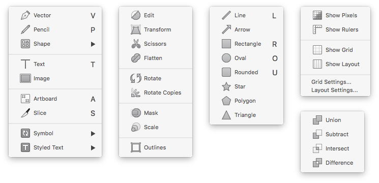

# Sketch Graphite UI  
Graphite interface ( replacement ) icons for Sketch.app on Mac OS. Includes new toolbar + inspector icons for version `41` and deprecated icons for version `40` and below.    

## Preview  
  

## Installation
###Quick:  
1. Paste the following snippet in Terminal.app          
`curl -s https://raw.githubusercontent.com/nathco/Graphite-UI/master/Install/Graphite-v41.sh | sh`
2. Relaunch Sketch.app    

###Manual:  
1. Download and open `Graphite-UI-master.zip`  
2. Copy icon files from `Graphite/v41/`
3. Paste icon files into `Applications/Sketch.app/Contents/Resources/`
4. Relaunch Sketch.app  

###Reset Default:  
1. Paste the following snippet in Terminal.app       
`curl -s https://raw.githubusercontent.com/nathco/Graphite-UI/master/Install/Default-v41.sh | sh`
2. Relaunch Sketch.app     

## Why Graphite?  
Mac OS has a system preference for **Graphite** appearence. Unfortunately, Sketch does not. In my opinion, Sketch’s interface feels a bit chintzy and the multi-colored icons are distracting. These graphite replacement icons will, hopefully, help designers focus on the content ( not the UI ), while still being quickly recognizable and accessible.  

## Feedback  
If you discover any issues or have questions regarding usage, please send a message to [code@nath.co](mailto:code@nath.co) or find me on GitHub [@nathco](https://github.com/nathco).